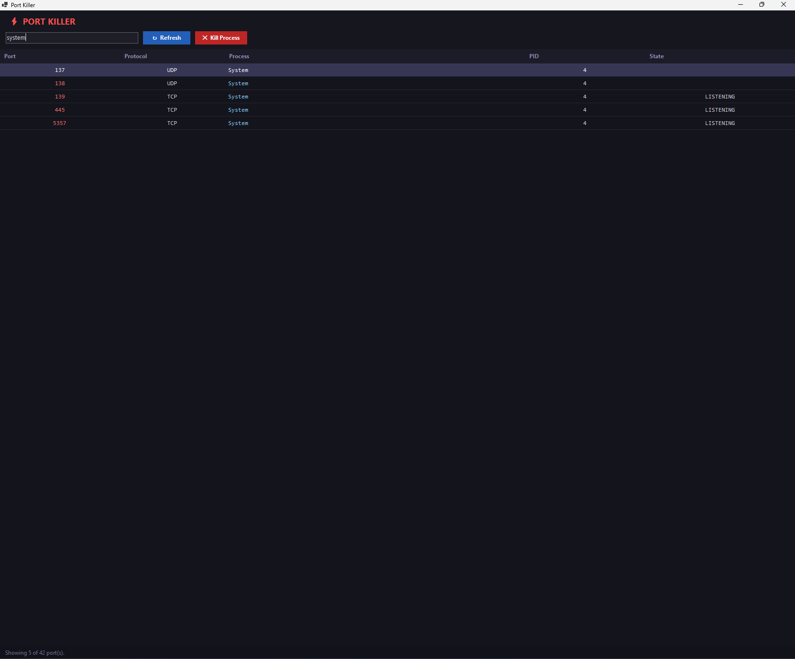

# ⚡ Port Killer

> See what's running on which port. Kill it instantly. No installs, no cloud, no nonsense.

Every developer has typed `netstat -ano` a thousand times, then cross-referenced PIDs in Task Manager. **Port Killer** skips all that — one window, one click.



---

### 🔒 100% Local. Always.

Port Killer runs entirely on your machine — no network requests, no telemetry, no data stored anywhere. No account, no installer, no background service. It reads your open ports using the same `netstat` Windows has always had, and that's it.

**What's on your machine stays on your machine.**

---

## Features (v0.1)

- Lists all **TCP listening** and **UDP** ports on your machine
- Shows **port number**, **protocol**, **process name**, and **PID**
- **Filter** by port number or process name
- **One-click kill** — terminates the process holding a port
- Refresh on demand

## Requirements

**Running a release binary** — nothing. Just Windows 10/11. The `.exe` is self-contained.

**Building from source** — Windows 10/11 + [.NET 10 SDK](https://dotnet.microsoft.com/download/dotnet/10.0).

## Running from Source

```bash
git clone https://github.com/YOUR_USERNAME/port-killer.git
cd port-killer
dotnet run --project src/PortKiller
```

> **Note:** To kill processes owned by system services you may need to run as Administrator.

## Building a Release Binary

```bash
dotnet publish src/PortKiller -c Release -r win-x64 --self-contained true -p:PublishSingleFile=true -o ./publish
```

This produces a single `PortKiller.exe` that runs on any Windows 10/11 machine with no dependencies.

## Roadmap

PRs and issues welcome!

## License

MIT